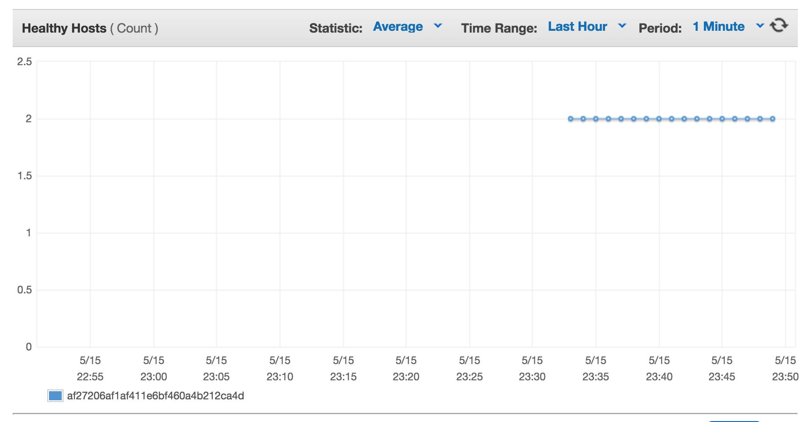
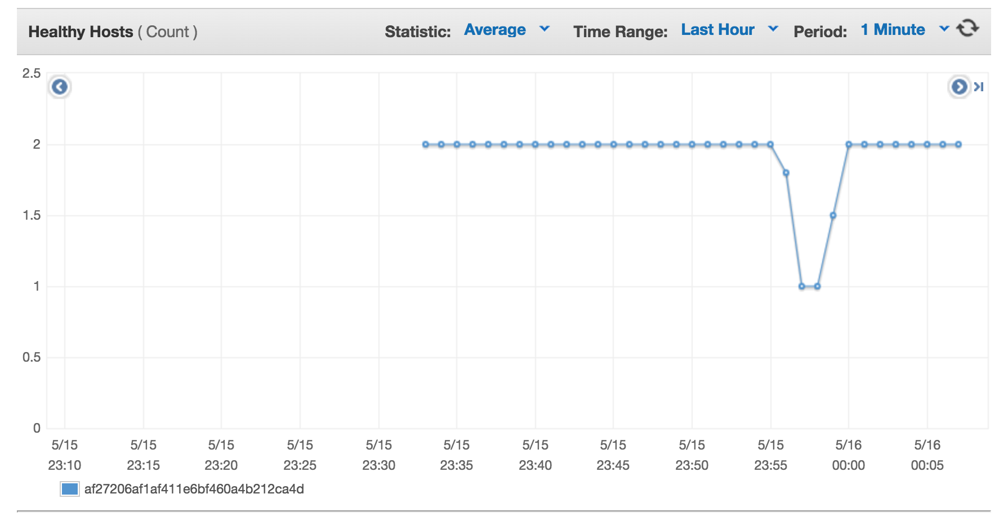

# Introduction

We are going to turn on three CoreOS VMs under AWS. Then we will deploy a simple web application on top. Once configured we will do various fire drills of different failures of Kubernetes.

## Pre-Requisites

- An [AWS account](http://aws.amazon.com/) and [AWS cli](https://aws.amazon.com/cli/)
  - An [AWS keypair for us-west-2](https://us-west-2.console.aws.amazon.com/ec2/v2/home?region=us-west-2#KeyPairs:sort=keyName)
- [kube-aws](https://coreos.com/kubernetes/docs/latest/kubernetes-on-aws.html) installed and in your path
- [kubectl 1.2.4](https://coreos.com/kubernetes/docs/latest/configure-kubectl.html) installed and in your path

## Testing Pre-Requistes

**AWS CLI**

Test that we have a keypair that works and is avaiable in our region:

```
aws ec2 --region us-west-2 describe-key-pairs
{
    "KeyPairs": [
        {
            "KeyName": "philips",
            "KeyFingerprint": "d5:1d:22:c5:cb:57:c3:8d:25:4b:29:f0:f2:9a:96:c9"
        }
    ]
}
```

**kube-aws**

```
kube-aws --help 
kube-aws version v0.7.0
```

**kubectl**

```
$ kubectl version
Client Version: version.Info{Major:"1", Minor:"2", GitVersion:"v1.2.3", GitCommit:"882d296a99218da8f6b2a340eb0e81c69e66ecc7", GitTreeState:"clean"}
```

## Initial Cluster Setup

Clone this repo:

```
git clone https://github.com/philips/2016-OSCON-containers-at-scale-with-Kubernetes
cd 2016-OSCON-containers-at-scale-with-Kubernetes
```

Create a directory for cluster configuration and move into it before following the `kube-aws` setup below.

```
mkdir mycluster
cd mycluster
```

Follow the [Kubernetes + CoreOS + AWS docs](https://coreos.com/kubernetes/docs/latest/kubernetes-on-aws.html). Once you get to `kube-aws init` use mycluster.example.com as the `external-dns-name` unless you have a registered domain you wish to use for this cluster 

```
kube-aws init --cluster-name=mycluster \
--external-dns-name=mycluster.example.com \
```

The final step of these instructions, `kube-aws up` wll take some time. While it is building out that infrastructure we can cover the TLS setup.

### Understanding the Credential Setup

The `credentials` directory has several x509 private keys and certificates and a single certificate authority generated:

```
ls -la credentials/
-rw-------  1 philips  staff  1675 May 13 17:50 admin-key.pem
-rw-------  1 philips  staff  1086 May 13 17:50 admin.pem
-rw-------  1 philips  staff  1675 May 13 17:50 apiserver-key.pem
-rw-------  1 philips  staff  1273 May 13 17:50 apiserver.pem
-rw-------  1 philips  staff  1675 May 13 17:50 ca-key.pem
-rw-------  1 philips  staff  1070 May 13 17:50 ca.pem
-rw-------  1 philips  staff  1679 May 13 17:50 worker-key.pem
-rw-------  1 philips  staff  1155 May 13 17:50 worker.pem
```

The CA generated by `kube-aws` is used to sign three different types of keys:

**api server key**: This is the Kubernetes API server certificate to secure API traffic.
**admin key**: This key authenticates kubectl to the API server. It is referenced in kubeconfg.
**worker**: This key authenticates the worker machines to the API server.

Confirm the admin key is signed by the CA by using the openssl tool:

```
openssl x509 -in credentials/admin.pem -text -noout
```

A production environment might have different sub-CAs but this configuration is a good trade-off of simplicity and security.

### Configure and Test the Cluster

The cluster should be booted now. Confirm by running `kube-aws status`:

```
kube-aws status
Cluster Name:   mycluster
Controller IP:  xx.xx.xx.xx
```

Add an entry in `/etc/hosts` for mycluster.example.com with the IP address printed above 

```
cat /etc/hosts
127.0.0.1	localhost
xx.xx.xx.xx mycluster.example.com
```

Configure kubectl to use the configuration that kube-aws generated:

```
alias kubectl="kubectl --kubeconfig=${PWD}/kubeconfig"
```

And access the cluster to confirm that two nodes have been registered:
Note: Navigate out of mycluster folder first 

```
kubectl get nodes
```

# Launch Our Production Application

With the cluster up launching the application is easy. The guestbook directory has everything needed to launch the app:

```
cd ../guestbook
kubectl create -f guestbook-controller.json
kubectl create -f guestbook-service.json
kubectl create -f redis-master-controller.json
kubectl create -f redis-master-service.json
kubectl create -f redis-slave-controller.json
kubectl create -f redis-slave-service.json
```

This will create a ELB that we can hit. But, it will take a few moments for everything to start, DNS to resolve and for health check to put stuff into the LB. While we are waiting lets dig through the app configurations.

*Read through each JSON file in turn, explaining the layout of the app*.

Now that we have a sense of how everything works try to go to the ELB console page and take a look at the health checks:

https://us-west-2.console.aws.amazon.com/ec2/v2/home?region=us-west-2#LoadBalancers:

Now that everything is up and running hit the ELB URL in your browser.


```
aws elb describe-load-balancers | jq '"http://" + .LoadBalancerDescriptions[].DNSName' -r
http://a8eedeefe1b4d11e685410a4b212ca4d-2012685803.us-west-2.elb.amazonaws.com
```

# Understand the Network

Port-forward cluster local DNS to your workstation.

```
kubectl port-forward --namespace=kube-system $( kubectl get pods --namespace=kube-system -l k8s-app=kube-dns -o template --template="{{range.items}}{{.metadata.name}}{{end}}") 5300:53
```

Try and grab the redis-master service powering our website:

```
dig +vc -p 5300 @127.0.0.1  redis-master.default.svc.cluster.local
redis-master.default.svc.cluster.local. 30 IN A 10.3.0.25
```

For more [network debugging tips see this page](https://github.com/coreos/docs/blob/master/kubernetes/network-troubleshooting.md).

# Fire Drills

We are going to run through a series of firedrills now:

## Recover etcd from Backup

Login to our control machine and stop etcd.

```
ssh core@mycluster.example.com
systemctl stop etcd2.service
```

Lets take a backup of the etcd data directory now. We will use this to simulate replacing etcd from backup in a moment.

```
cp -Ra /var/lib/etcd2 etcd2-backup
```

```
kubectl get pods
Error from server: client: etcd cluster is unavailable or misconfigured
```

And even with etcd down DNS will continue to be served.

```
dig +vc -p 5300 @127.0.0.1  redis-master.default.svc.cluster.local
```

Bring etcd back up and kubectl get pods work again:

```
kubectl get pods 
```

If cluster state is edit, say by adding a label to a replication controller, then killing a pod:

```
$ kubectl edit rc guestbook
replicationcontroller "guestbook" edited
$ kubectl get pods -l oscon=fun
$ kubectl delete pod guestbook-63bjl
pod "guestbook-63bjl" deleted
$ kubectl get pods -l oscon=fun
NAME              READY     STATUS    RESTARTS   AGE
guestbook-o95oz   1/1       Running   0          5s
```

At this point the etcd data on disk has diverged from the state in the current etcd. What will happen to the app?

```
systemctl stop etcd2
rm -Rf /var/lib/etcd2
cp -Ra etcd2-backup/ /var/lib/etcd2
reboot
```

The cluster reconciled to the previous state at the time the backup was taken. Again, without application downtime.

```
$ kubectl get pods -l oscon=fun
```

## Simulate an API server failure

The API server is the service running on cluster that the kubectl tool, and other clients, interacts with. It runs in the kube-system namespace, so lets get information on this service.

```
kubectl get pods --namespace=kube-system
NAME                                                              READY     STATUS    RESTARTS   AGE
heapster-v1.0.2-808903792-p6eej                                   2/2       Running   0          1d
kube-apiserver-ip-10-0-0-50.us-west-2.compute.internal            1/1       Running   0          2m
kube-controller-manager-ip-10-0-0-50.us-west-2.compute.internal   1/1       Running   1          1d
kube-dns-v11-fhouu                                                4/4       Running   0          1d
kube-proxy-ip-10-0-0-227.us-west-2.compute.internal               1/1       Running   0          1d
kube-proxy-ip-10-0-0-228.us-west-2.compute.internal               1/1       Running   1          1d
kube-proxy-ip-10-0-0-50.us-west-2.compute.internal                1/1       Running   0          1d
kube-scheduler-ip-10-0-0-50.us-west-2.compute.internal            1/1       Running   2          1d
```

Describe the pod and to find that the command that runs the API server is `hyperkube apiserver`.

```
kubectl describe pods --namespace=kube-system kube-apiserver-ip-10-0-0-50.us-west-2.compute.internal
```

Next, ssh into the control machine, find the PID of the API server, and kill it.

```
ssh core@mycluster.example.com
ps aux | grep "hyperkube apiserver"
root     21335  2.9  2.1 389708 83808
```

```
sudo kill 21335
```

At this point the API server will be down. Issuing `kubectl get pods` will return an error:

```
kubectl get pods
The connection to the server mycluster.example.com was refused - did you specify the right host or port?
```

Luckily, Kubernetes will self heal and in a few moments that command will succeed.

Furthermore! The service we are running should remain fully available.



## Simulate Failure of Scheduler

The scheduler's job is to land work on to machines that can run them. When it fails new work doesn't land. Lets simulate a bug in the scheduler and see what happens.

Temporarily disable the scheduler by removing it from the controller manifests:

```
ssh core@mycluster.example.com
mv /etc/kubernetes/manifests/kube-scheduler.yaml /tmp
```

**Note**: in the near future of [self-hosted Kubernetes](https://www.youtube.com/watch?v=A49xXiKZNTQ&t=360s) you will be able to do this using kubectl!

Now, lets try and scale our application from 3 processes to 5. 

```
kubectl scale rc guestbook --replicas=5
replicationcontroller "guestbook" scaled
```

Looks like it worked great! Lets check it out!

```
kubectl get rc
NAME              DESIRED   CURRENT   AGE
guestbook         5         5         4h
```

Unfortunately, none of these new processes are starting up! What is going on?

```
kubectl get pods -l app=guestbook
NAME              READY     STATUS    RESTARTS   AGE
guestbook-4z4gp   0/1       Pending   0          1m
guestbook-5plrs   0/1       Pending   0          1m
guestbook-ajqqo   1/1       Running   0          4h
guestbook-rrbv4   1/1       Running   0          4h
guestbook-u6h2o   1/1       Running   0          4h
```

Scaling happens separately from scheduling. So, what has happened is that the controller manager has created these new pods based on the new desired state. But, no process is running to schedule these new pods.

Moving the scheduler back into place will resolve the issue:

```
ssh core@mycluster.example.com
mv /tmp/kube-scheduler.yaml /etc/kubernetes/manifests/
```

And there the scheduler goes, the processes are now running:

```
kubectl get pods -l app=guestbook
NAME              READY     STATUS    RESTARTS   AGE
guestbook-4z4gp   1/1       Running   0          13m
guestbook-5plrs   1/1       Running   0          13m
guestbook-ajqqo   1/1       Running   0          4h
guestbook-rrbv4   1/1       Running   0          4h
guestbook-u6h2o   1/1       Running   0          4h
```

## Simulate Failure of Controller Manager

The controller manager's job is to reconcile the current state of the system with the user's desired state. Primarily this means it is looking for over/under serviced replication controllers and replica sets and destroying/creating pods.

Temporarily disable the controller manager by removing it from the controller manifests:

```
ssh core@mycluster.example.com
mv /etc/kubernetes/manifests/kube-controller-manager.yaml /tmp
```

**Note**: in the near future of [self-hosted Kubernetes](https://www.youtube.com/watch?v=A49xXiKZNTQ&t=360s) you will be able to do this using kubectl!

Now, lets try and scale our application from 5 pods to 3.

```
kubectl scale rc guestbook --replicas=3
replicationcontroller "guestbook" scaled
```

Looks like it worked great! Lets check it out!

```
kubectl get rc
NAME              DESIRED   CURRENT   AGE
guestbook         5         5         4h
```

Unfortunately, none of the old processes are stopping! What is going on?

```
kubectl get pods -l app=guestbook
NAME              READY     STATUS    RESTARTS   AGE
guestbook-4z4gp   1/1       Running   0          14m
guestbook-5plrs   1/1       Running   0          14m
guestbook-ajqqo   1/1       Running   0          4h
guestbook-rrbv4   1/1       Running   0          4h
guestbook-u6h2o   1/1       Running   0          4h
```

Delete three pods:

```
kubectl delete pod guestbook-4z4gp 
kubectl delete pod guestbook-ajqqo
kubectl delete pod guestbook-u6h2o
```

Oops, this deleted too many pods in fact. Now the cluster has even fewer running pods than desired. This is a potential danger of having the controller manager down. Lets recover the controller manager to get this going again!

```
kubectl get pods -l app=guestbook
NAME              READY     STATUS    RESTARTS   AGE
guestbook-5plrs   1/1       Running   0          18m
guestbook-rrbv4   1/1       Running   0          4h
```

Moving the controller manager back into place will resolve the issue:

```
ssh core@mycluster.example.com
mv /tmp/kube-controller-manager.yaml /etc/kubernetes/manifests/
```

And there the manager goes, the new pods are created and now running:

```
kubectl get pods -l app=guestbook
NAME              READY     STATUS    RESTARTS   AGE
guestbook-36c3s   1/1       Running   1          4s
guestbook-5plrs   1/1       Running   0          19m
guestbook-rrbv4   1/1       Running   0          4h
```

## Scaling Cluster Up

Scaling the cluster up is pretty easy using AWS Auto Scaling Groups. Find the name of the autoscale group using the aws cli:

```
aws autoscaling describe-auto-scaling-groups  | jq .AutoScalingGroups[].AutoScalingGroupARN -c -r
arn:aws:autoscaling:us-west-2:334544467761:autoScalingGroup:04f1009d-2ae8-4265-8e99-72395229a7b9:autoScalingGroupName/mycluster-AutoScaleWorker-RDWPOE65KS2M
```

Then use that name to scale the cluster up to 3 machines:

```
aws autoscaling update-auto-scaling-group --auto-scaling-group-name myluster-AutoScaleWorker-RDWPOE65KS2M --min-size 3 --max-size 3
```

After a few minutes this machine will appear in the node list. But, how does this magic happen?!

To bootstrap into the cluster a machine only needs a little bit of metadata. This metadata is passed in via AWS userdata. Lets take a look!

First, find out the LaunchConfigurationWorker name:

```
aws autoscaling describe-auto-scaling-groups  | jq .AutoScalingGroups[].LaunchConfigurationName -c -r
ok-cluster-LaunchConfigurationWorker-7N3BDQZ1UZ2
```

Then dump out the base64 endcoded User Data:

```
aws autoscaling describe-launch-configurations --launch-configuration-names ok-cluster-LaunchConfigurationWorker-7N3BDQZ1UZ2 | jq .LaunchConfigurations[].UserData -r  | base64 -D | gzip -d
```

In here we are going to find some interesting sections:

- IP address of the control machine
- Setup of the x509 certificates and decrypting with AWS KMS
- Version number of the kubelet to run
- Configuration of the flannel network

## Simulate Planned Upgrade of a Worker

The cluster will have three members

```
$ kubectl get nodes
NAME                                       STATUS                     AGE
ip-10-0-0-227.us-west-2.compute.internal   Ready                      1d
ip-10-0-0-228.us-west-2.compute.internal   Ready                      1d
ip-10-0-0-50.us-west-2.compute.internal    Ready,SchedulingDisabled   1d
```

Choose one of the machines and tell Kubernetes to drain work off of it:

```
$ kubectl drain ip-10-0-0-228.us-west-2.compute.internal --force
node "ip-10-0-0-228.us-west-2.compute.internal" cordoned
```

After draining the node should get no additional work as it will be labeled "SchedulingDisabled":

```
$ kubectl get nodes
NAME                                       STATUS                     AGE
ip-10-0-0-228.us-west-2.compute.internal   Ready,SchedulingDisabled   1d
```

Lets uncordon the machine and get it back into the load balancer:

```
$ kubectl uncordon ip-10-0-0-228.us-west-2.compute.internal
node "ip-10-0-0-228.us-west-2.compute.internal" uncordoned
```

During this exercise we will see that the machine went from Healthy to Unhealthy to back in our application ELB:



## Failure of a Worker Machine

Choose a worker machine at random to be part of this test:

```
kubectl get nodes
NAME                                       STATUS                     AGE
ip-10-0-0-231.us-west-2.compute.internal   Ready                      1d
```

Find the public IP of the random worker machine.

```
kubectl describe node ip-10-0-0-231.us-west-2.compute.internal  | grep Addresses
Addresses:      10.0.0.231,10.0.0.231,52.39.160.184
```

Stop the kubelet which will cause it to stop sending heartbeats to the control plan:

```
ssh 52.39.160.184 -l core sudo systemctl stop kubelet
```

```
kubectl events -w
FIRSTSEEN                       LASTSEEN                        COUNT     NAME                                       KIND      SUBOBJECT   TYPE      REASON         SOURCE                 MESSAGE
2016-05-16 06:07:56 -0500 CDT   2016-05-16 06:07:56 -0500 CDT   1         ip-10-0-0-231.us-west-2.compute.internal   Node                  Normal    NodeNotReady   {controllermanager }   Node ip-10-0-0-231.us-west-2.compute.internal status is now: NodeNotReady
2016-05-16 05:54:14 -0500 CDT   2016-05-16 06:08:04 -0500 CDT   5         guestbook   Service             Normal    UpdatedLoadBalancer   {service-controller }   Updated load balancer with new hosts
```

This happens after about 1 minute. Then we need to wait 5 minutes more for the Controller Manager to remove load from the machine. Look at the [docs](http://kubernetes.io/docs/admin/kube-controller-manager/) for details on how that can be tweaked.

```
kubectl get events
2m          2m         1         ip-10-0-0-231.us-west-2.compute.internal   Node                                                       Normal    TerminatingEvictedPod    {controllermanager }                                    Node ip-10-0-0-231.us-west-2.compute.internal event: Pod guestbook-63bjl has exceeded the grace period for deletion after being evicted from Node "ip-10-0-0-231.us-west-2.compute.internal" and is being force killed
2m          2m         1         ip-10-0-0-231.us-west-2.compute.internal   Node                                                       Normal    TerminatingEvictedPod    {controllermanager }                                    Node ip-10-0-0-231.us-west-2.compute.internal event: Pod kube-prometheus-ld49x has exceeded the grace period for deletion after being evicted from Node "ip-10-0-0-231.us-west-2.compute.internal" and is being force killed
2m          2m         1         ip-10-0-0-231.us-west-2.compute.internal   Node                                                       Normal    TerminatingEvictedPod    {controllermanager }                                    Node ip-10-0-0-231.us-west-2.compute.internal event: Pod redis-master-kq5n1 has exceeded the grace period for deletion after being evicted from Node "ip-10-0-0-231.us-west-2.compute.internal" and is being force killed
2m          2m         1         ip-10-0-0-231.us-west-2.compute.internal   Node                                                       Normal    TerminatingEvictedPod    {controllermanager }                                    Node ip-10-0-0-231.us-west-2.compute.internal event: Pod kube-proxy-ip-10-0-0-231.us-west-2.compute.internal has exceeded the grace period for deletion after being evicted from Node "ip-10-0-0-231.us-west-2.compute.internal" and is being force killed
2m          2m         1         ip-10-0-0-231.us-west-2.compute.internal   Node
```


Put the machine back in rotation by restarting the kubelet:

```
ssh 52.39.160.184 -l core sudo systemctl restart kubelet
```

And the machine will re-enter the cluster:

```
kubectl describe  node ip-10-0-0-227.us-west-2.compute.internal
```

## Downgrade/Upgrade the Kubelet

Choose a worker machine at random to be part of this test:

```
kubectl get nodes
NAME                                       STATUS                     AGE
ip-10-0-0-227.us-west-2.compute.internal   Ready                      1d
```

Find the public IP of the random worker machine.

```
kubectl describe node ip-10-0-0-227.us-west-2.compute.internal  | grep Addresses
Addresses:      10.0.0.227,10.0.0.227,52.39.138.102
```

ssh into the hosts public and change the version of the kubelet in the service file, reboot the kubelet (or node)

```
ssh core@52.39.138.102
sudo vim /etc/systemd/system/kubelet.service
sudo systemctl daemon-reload && sudo systemctl restart kubelet
sudo journalctl -u kubelet -f
```

Confirm that the kubelet reports the new version:

```
kubectl describe node ip-10-0-0-227.us-west-2.compute.internal | grep "Kubelet Version"
```

Once a single machine is tested consider updating the autoscaling group.
